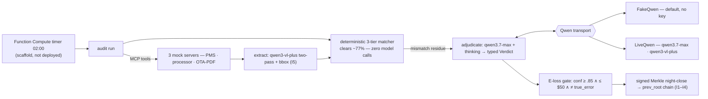

<div align="center">
  
  <h1>🛎️ Innkeeper</h1>
  <p><em>The night audit finally sleeps — an autopilot night auditor that reconciles three ledgers, adjudicates every mismatch with cited evidence, and signs the books.</em></p>
  

  <br/><br/>

  [](https://innkeeper.edycu.dev)
  [](https://innkeeper.edycu.dev/pitch/)
  [](DEMO.md)
  [](https://qwencloud-hackathon.devpost.com/)

  <br/>

  
  
  
  
  
  
  
  [](LICENSE)
  [](https://github.com/edycutjong/innkeeper/actions/workflows/ci.yml)
</div>

> An autopilot night auditor for small hotels. Every night at 2 AM it reconciles
> the property-management ledger against the card processor's settlements and the
> OTA's PDF statement, **adjudicates every mismatch with cited evidence and
> competing hypotheses**, auto-clears the confident ones inside an expected-loss
> policy gate, and queues only the material discrepancies for the owner's coffee —
> then signs the night's books cryptographically.

*A husband-and-wife inn runs 14 rooms; every night one of them stays up past
midnight squinting at three statements that disagree by $6.67 — because the last
time they let it slide, it was $2,300 by month-end.*

> No live demo URL — Innkeeper is a **CLI + MCP servers**, not a hosted web
> app. Everything above runs locally, offline, with zero API keys; see
> [`DEMO.md`](./DEMO.md) for the exact copy-paste script.

---

> ### ⚠️ MOCK SYSTEMS — read this first
>
> The three source systems (PMS, card processor, OTA) are **mocks**, shipped in
> this repo as three **MCP-compatible servers** (`mcp/`) that read from a
> committed, deterministically **seeded** 14-room month. This is the honest path
> to realism: the data is a coherent month with planted, ground-truth-labeled
> discrepancy archetypes and **real reportlab-rendered OTA PDFs**.
>
> **Which transport runs, precisely:** the offline demo and every test run on
> **`FakeQwen`** — a deterministic stand-in that computes each verdict from the
> mismatch's own arithmetic and memos (the same signals `qwen3.7-max` reasons
> over) and parses the committed statement sidecar; **it makes no VL call and
> never reads the ground-truth labels.** The real **`qwen3-vl-plus`** two-pass
> read of the 8-pt PDF and **`qwen3.7-max`** adjudication run only under
> **`--live`** with a `DASHSCOPE_API_KEY` — a real, key-gated path you can run
> yourself (see the **Run the real Qwen path (`--live`)** section below);
> the reportlab PDFs exist so that path has a genuine document to read.
>
> **No live PMS/processor/OTA is contacted, and Innkeeper is decision support
> with signed evidence, not an accounting system of record.** The graded core
> runs **offline with zero API keys.**

---

## 🚀 Quickstart (offline, no keys)

```bash
python3.12 -m venv .venv && source .venv/bin/activate
pip install -e ".[dev]"

innkeeper seed --nights 30        # deterministic month + rendered OTA statement PDFs
innkeeper run --night 2026-07-04  # fetch → extract → match → adjudicate → gate → signed close
innkeeper replay --night 2026-07-04  # re-derive byte-identical, zero keys (invariant I4)
innkeeper verify-chain            # recompute every root, check every signature
innkeeper bench                   # 277/281 auto-cleared · 0 false clears · accuracy 0.9964
pytest -q                         # 404 passed
```

The full demo script is in [`DEMO.md`](./DEMO.md).

## 🔑 Run the real Qwen path (`--live`)

The offline demo above proves the whole pipeline with **zero keys**. To exercise
the actual Qwen Cloud models on the real reportlab-rendered statement — the one
step this project can't fake — add your key and the `live` extra:

```bash
pip install -e ".[live]"                 # openai + pypdfium2 rasterizer
export DASHSCOPE_API_KEY=sk-…            # dashscope.console.aliyun.com/apiKey
innkeeper run --night 2026-07-04 --live  # SAME pipeline, real models
```

Under `--live` the extractor is `LiveQwen`: it **rasterizes the committed 8-pt
OTA PDF and calls `qwen3-vl-plus` twice** (temperatures 0.0 / 0.4) — agreement
becomes confidence, disagreement escalates (I5) — and the mismatch residue is
adjudicated by **`qwen3.7-max` + thinking** returning typed JSON the gate
computes over. The evidence citations are bound to the on-disk sha256 hashes
either way, so a live verdict can never cite a hash that doesn't resolve. This
is the single key-gated path; nothing else needs a network.

## 🏗️ The pipeline



<sub>**As built** = the three source systems are in-repo **mocks** (disclosed above); everything is green on FakeQwen, keyless. Live `qwen3-vl-plus` / `qwen3.7-max` sit behind `DASHSCOPE_API_KEY`; the 02:00 FC timer is configured (`infra/fc/`), not deployed. Plain-text view below.</sub>

```
fetch (3× MCP)  →  extract (qwen3-vl-plus, two-pass + bbox)  →  deterministic match
   →  adjudicate the residue (qwen3.7-max + thinking)  →  E[loss] policy gate
   →  signed Merkle night-close  →  chain
```

A deterministic three-tier matcher (`ref_exact → fuzzy-ref → amount+date`) clears
~77% of transactions with **zero model calls**. Only the mismatch residue reaches
the language model. Every verdict is a typed [`Verdict`](./src/innkeeper_audit/schemas.py):
a classification, **evidence citations from ≥2 systems** (each bound by sha256),
competing hypotheses, and a confidence — so the gate is *math over typed fields*,
not vibes.

**The policy gate is expected-loss math, not a button:**

```
auto_clear ⟺ confidence ≥ 0.85 ∧ materiality ≤ $50 ∧ class ≠ true_error
generalised:  E[loss] = amount × (1 − confidence) ≤ τ
```

Two hard constraints can only ever *queue*: a `true_error` classification (I1)
and a two-pass extraction disagreement (I5).

## 🔒 Invariants (tested, not promised)

| | Invariant | Test |
|---|---|---|
| **I1** | **Zero false auto-clears on the planted true errors across all 30 nights** — the load-bearing one | `test_invariants.py::test_I1_*` |
| I2 | Every verdict cites ≥2 systems with resolvable sha256 hashes | `test_I2_*` (parametrised × 30 nights) |
| I3 | The signed close chain verifies; a one-byte tamper (verdict / evidence / root) fails | `test_I3_*` |
| I4 | `replay --night N` reproduces identical verdicts, root, and signature | `test_I4_*` (× 30 nights) |
| I5 | A two-pass extraction disagreement always escalates, never averages | `test_I5_*` |

## 📈 Benchmark

Seeded month, 30 nights, 1199 transactions, FakeQwen (deterministic, offline).
Regenerate with `python scripts/bench.py` → [`docs/BENCH.md`](./docs/BENCH.md).

| metric | value | target |
|---|---|---|
| classification accuracy | **0.9964** | ≥ 0.92 |
| HITL action accuracy | 1.0000 | — |
| **false auto-clears on true errors** | **0** | **0 (invariant)** |
| auto-cleared / mismatches | 277/281 (98.58%) | — |
| queue precision / recall | 1.00 / 1.00 | — |
| residue fraction (LLM-touched) | 23.44% | small |
| runtime (30 nights, offline) | 0.16s | < 5 min/night |
| modelled cost / night | $0.0327 | ~$0.15 |

The single class disagreement is the page-broken row **correctly declining to
classify** (`unknown`) while still queueing — the right call under I5. Across the
whole **τ-sweep** the false-clear column stays **0**: the true-error and
escalation constraints hard-queue at every threshold, so the risk knob trades
automation against review load without ever touching the safety floor.

## 🧩 Why only Qwen Cloud

| Qwen surface | What it does here | Without it |
|---|---|---|
| **`qwen3-vl-plus`** | reads the 8-pt OTA statement table, **bbox-cited** per figure | a document-AI vendor bill + losing the evidence-highlight |
| two-pass VL agreement | agreement = confidence, disagreement = escalation (I5) | single-pass misreads corrupt money decisions silently |
| **`qwen3.7-max` + thinking** | ranks *competing hypotheses over evidence* | plus-tier collapses to the first plausible story |
| structured output | the E[loss] gate has typed fields to compute over | free-text verdicts can't be gated, benched, or replayed |
| function calling / **3× MCP** | typed, logged tool calls = the replayable decision log | bespoke connectors; forfeits the rubric's named example |

Remove Qwen Cloud and a 14-room inn needs a document-AI vendor, a frontier LLM,
and a tool-orchestration framework — three bills it will never pay, and no
single-vendor trail to sign into the books.

## 🗂️ Layout

```
src/innkeeper_audit/   amounts · config · schemas · crypto · matcher · policy
                       pipeline · report · verify · benchmark · cli
   qwen/               fake (offline) · live (DashScope) · base
   mcp/                server (JSON-RPC) · tools · pms/processor/ota
mcp/                   pms_server.py · processor_server.py · ota_server.py (stdio)
scripts/               bench.py · verify_offline.py · check_submission_readiness.py
infra/fc/              s.yaml (02:00 timer) · audit_handler.py · PROOF.md
tests/                 404 tests
docs/                  BENCH.md · friction-log.md
```

## ✅ Testing & CI

**5-stage pipeline:** Quality → Security → Build → Offline Proof → Deploy Gate.

```bash
# ── Code Quality ────────────────────────────
ruff check .                                    # lint
mypy src                                        # type check (advisory on qwen/live.py)
pytest --cov=innkeeper_audit --cov-report=term  # 404 tests, 100% coverage

# ── Offline Proof (the invariants, live) ────
innkeeper seed --nights 30
innkeeper run --night 2026-07-04
innkeeper replay --night 2026-07-04             # I4: byte-identical re-derivation
innkeeper verify-chain                          # I3: every root + signature checked
python scripts/verify_offline.py                # socket-guarded tamper proof
innkeeper bench                                 # I1: 0 false auto-clears, always

# ── Security ────────────────────────────────
pip-audit                                       # dependency vulnerability scan
```

| Layer | Tool | Status |
|---|---|---|
| Code Quality | ruff + mypy | ✅ |
| Unit Testing | pytest, 404 tests, 100% coverage | ✅ |
| Invariant Testing | I1–I5, parametrised × 30 nights | ✅ |
| Security (SAST) | CodeQL (`python`) | ✅ |
| Security (SCA) | Dependabot (`pip`) + `pip-audit` | ✅ |
| Secret Scanning | TruffleHog | ✅ |
| Build Verification | sdist/wheel + CLI entrypoint smoke test | ✅ |

CI runs on every push/PR to `main` — see [`.github/workflows/ci.yml`](./.github/workflows/ci.yml).

## 📋 Status — honest

- ✅ **Offline core is complete and green**: seed, matcher, adjudication, gate,
  crypto, MCP, CLI, `bench`, `verify_offline`, **404 passing tests**.
- 🔑 **Live Qwen path is wired but behind `DASHSCOPE_API_KEY`** (`--live`):
  `qwen3-vl-plus` two-pass extraction and `qwen3.7-max` adjudication via the
  DashScope OpenAI-compatible endpoint. Not exercised in the offline suite by
  design; the deterministic `FakeQwen` computes verdicts from the same signals.
- ⏳ **FC 02:00 timer is configured, not deployed** — [`infra/fc/`](./infra/fc/)
  has the real `s.yaml` + handler; a live console recording of the cron firing
  needs an Alibaba account + funded key (see [`PROOF.md`](./infra/fc/PROOF.md)).
- ○ **`report.html` is optional** (single-page render via `innkeeper report
  --night N --html`); the primary report is Markdown. No Next.js UI shipped —
  the CLI + signed ledger are the product surface.

Built solo in a five-project sprint. The night auditor finally sleeps.

## 🤝 Contributing & Security

Issue/PR templates, Code of Conduct, and a security policy live under
[`.github/`](./.github/) — see [`CONTRIBUTING.md`](./.github/CONTRIBUTING.md)
and [`SECURITY.md`](./.github/SECURITY.md).

## 📄 License
[MIT](LICENSE) © 2026 Edy Cu

## 🏷️ Versioning

This project uses [Semantic Versioning](https://semver.org) with **fully automated** version
management driven by [Conventional Commits](https://www.conventionalcommits.org) — the version is
never edited by hand.

| Commit type | Bump | Example |
|---|---|---|
| `fix: …` | patch | 1.0.0 → 1.0.1 |
| `feat: …` | minor | 1.0.0 → 1.1.0 |
| `feat!: …` or `BREAKING CHANGE:` footer | major | 1.0.0 → 2.0.0 |

[python-semantic-release](https://python-semantic-release.readthedocs.io) keeps the version in sync
across `pyproject.toml` and `src/innkeeper_audit/__init__.py`.

- **In CI/CD:** Stage 6 of the pipeline (`.github/workflows/ci.yml`) runs on every push to `main`,
  computes the next version from the commits since the last tag, then commits + tags it automatically.
- **Locally:**
  ```bash
  pip install -e ".[release]"
  semantic-release version    # compute + apply the next version and tag
  ```

